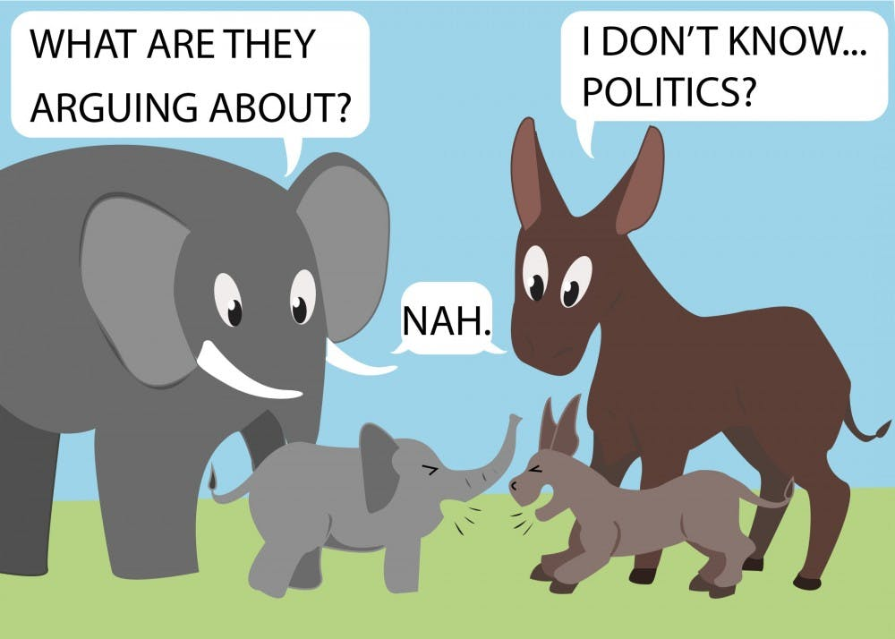

# Applied Data Science @ Columbia
## Fall 2020
## Project 1: A "data story" on how Americans vote



### [Project Description](doc/)
This is the first and only *individual* (as opposed to *team*) this semester. 

Term: Fall 2020

+ Projec title: Do Millennials care about politics?
+ This project is conducted by Xinyuan Peng

+ Project summary: “When It Comes to Politics, Do Millennials Care About Anything?”, the Article posted on the Atlantic caught our attention. Millennials, who were born between 1981 and 1996, have been labeled with countless negative qualities. One main criticism of millennials is their lack of political concern. However, is it true to label them being indifferent about politics? We are going to testify the argument based on the data from 2020 Exploratory Testing Survey.

Following [suggestions](http://nicercode.github.io/blog/2013-04-05-projects/) by [RICH FITZJOHN](http://nicercode.github.io/about/#Team) (@richfitz). This folder is orgarnized as follows.

```
proj/
├── dev/
├── data/
├── doc/
├── figs/
└── output/
```

Please see each subfolder for a README file.
